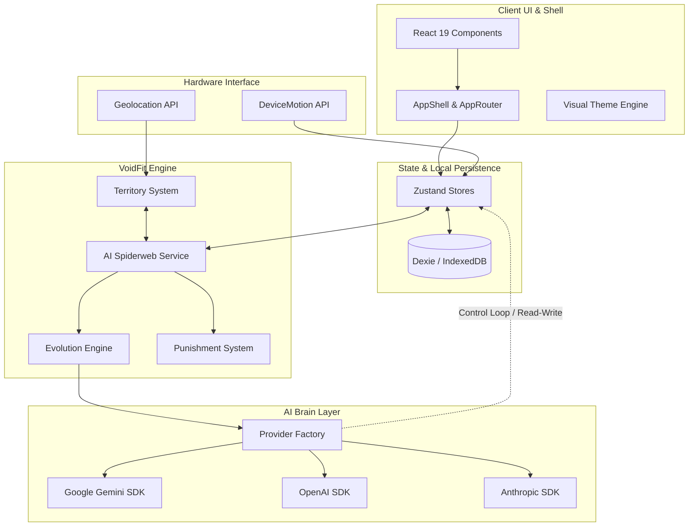

# 🌌 VOIDFIT AI — FITNESS OS
### "Turn your physiological existence into an RPG. Track, evolve, conquer, or face the consequences."

VoidFit AI is a premium, gamified, AI-powered Fitness OS that turns your daily physical training, recovery, and nutrition habits into a immersive Role-Playing Game (RPG). Earn Experience Points (XP), level up your character, allocate skill points on a customizable skill tree, complete dynamically generated daily quests, claim real-world geographical zones, and collaborate or compete with friends in guilds and PvP.

Built using **React 19**, **TypeScript**, and **Vite 6**, the app is engineered to be **offline-first** (powered by **Dexie** and **IndexedDB**) with optional cloud synchronization through **Firebase 11**.

---

## 🎛️ System Architecture



---

## 🎮 Game Systems & RPG Mechanics

### 1. Progression & Ranks
Your fitness status is unified under a single character sheet. 
- **Levels & XP**: Completing workouts, capturing territories, logging recovery, and hitting step goals grants XP. Reaching the XP threshold triggers a visual Level-Up ceremony, granting **+5 Stat Points**.
- **Stat Allocation**: Players manually allocate points into six core attributes:
  - **Strength**: Modifies combat power and strength-related task efficiency.
  - **Endurance**: Boosts cardiorespiratory thresholds and speed ratings.
  - **Flexibility**: Reduces injury rates and improves posture metrics.
  - **Combat**: Influences multiplayer PvP calculations.
  - **Nutrition**: Enhances metabolic efficiency and calorie targets.
  - **Recovery**: Increases recovery speed scores and reduces fatigue penalties.
- **Ranks**: Auto-progress through adventurer-tier ranks: **E → D → C → B → A → S → SS → SSS** based on level achievements.

### 2. The Interactive Skill Tree
Features a custom node-based progression system. Accumulate XP in dedicated Realms (**Strength**, **Endurance**, **Mindfulness**, **Nutrition**) to unlock special active/passive nodes. 
- **Hidden Skills**: Reaching specific levels in primary skills automatically reveals secret skill paths (e.g., *Zen Breath*, *Iron Core*, *Sprint Surge*).

### 3. Active Buffs & Status Conditions
The AI can bestow items or positive status updates based on your behaviors, or you can purchase them.
- **XP Boost**: Multiplies incoming XP from all activities (e.g. `Double XP` x2.0).
- **Shield**: Prevents XP loss or level demotion if a daily commitment is missed.
- **Recovery Buff**: Multiplies sleep quality scoring models.

### 4. The Punishment System (Discipline Protocol)
Consistency is enforced programmatically by [PunishmentSystem.ts](file:///c:/Users/black/Downloads/Levelup-app-production-ready/Levelup-app-clean/src/services/PunishmentSystem.ts):
- **60-Second Grace Period**: On app startup/reload, active checks are deferred for 60 seconds to avoid accidental trigger loops due to db delays.
- **Daily Guard**: The system logs a `lastPenaltyDate` to guarantee a player is never penalized more than once per calendar day.
- **Deduction Triggers**:
  - `MISSION_FAILURE`: Deducts **500 XP** if a daily generated mission is failed.
  - `TOTAL_DISCIPLINE_FAILURE`: Deducts **1000 XP** if no habits are completed yesterday (active only after the 2nd day of install to prevent fresh-install penalties).
- **AI Reaction Integration**: On penalty trigger, the system invokes `reportEventToAi` to alert the AI Coach, writing a custom direct prompt warning to the user's logs.

---

## 🧠 The AI Orchestrator (Brain OS)

VoidFit AI utilizes a high-level cognitive loop that abstracts AI calls into a unified, secure, and reactive system.

### 1. Multi-Provider Abstraction
Located in [src/services/ai](file:///c:/Users/black/Downloads/Levelup-app-production-ready/Levelup-app-clean/src/services/ai), the factory instantiates the designated wrapper:
- `GeminiProvider`: Direct native integration supporting multimodal inputs (e.g., photo analysis, daily reports).
- `OpenAiProvider` & `AnthropicProvider`: Secondary engines running general chats and key validations.

### 2. The AI Adaptation Service (Control Loop)
Defined in [aiAdaptationService.ts](file:///c:/Users/black/Downloads/Levelup-app-production-ready/Levelup-app-clean/src/services/aiAdaptationService.ts), the AI acts as a **system controller** with direct read/write privileges over the user model. Every 6 hours, the AI:
- Reviews biometric stats, 7-day logs, sleep schedules, active injuries, and schedules.
- Computes behavioral trends (e.g., average completion rates, strongest/weakest realms).
- **Writes back** changes to the local state: toggling mode flags (`isInjuryMode`, `isLazyMode`), adding/removing habits, updating weight targets, adjusting step or water goals, and granting achievements/badges.

### 3. The AI Spiderweb Service (Unified Event Bus)
The [AiSpiderwebService.ts](file:///c:/Users/black/Downloads/Levelup-app-production-ready/Levelup-app-clean/src/services/AiSpiderwebService.ts) acts as a reactive nervous system.
- **Events Captured**: `MEAL_SCAN`, `STEP_UPDATE`, `WORKOUT_COMPLETE`, `RECOVERY_LOG`, `HABIT_DONE`, `MOOD_LOG`, `TERRITORY_CAPTURE`, `WATER_LOG`, `SUPPLEMENT_TAKEN`, `POSTURE_LOG`, `BODY_METRICS_UPDATE`.
- **Integrity Validation**: All metrics are checked for boundaries (e.g., posture scale 1-10, sleep hours 0-24, water amount 0-5000ml) to reject anomalies.
- **Cross-Effects Engine**: When an event fires, the Spiderweb automatically evaluates side-effects (e.g. `HABIT_DONE` inserts database records, updates streak metrics, and triggers a `Strength` realm reward).
- **Integrity Hashing**: Generates an obfuscated state integrity hash of the user snapshot:
  $$\text{hash} = \text{date} + \text{calories} + \text{protein} + \text{steps} + \text{water} + \text{recovery} + \text{habits}$$
  This detects unauthorized data tampering and keeps track of a 500-entry audit log.
- **Context Builder**: Compacts daily statistics and current flags (e.g., `⚠Sleep deprived`, `⚠High stress`, `⚠Low motivation`) into a standardized string format for direct consumption by LLM prompts:
  `[2026-06-18|CAL:1500/2000|PRO:120/150g|STP:8000/10000|WTR:2000/3000ml|MISS:1/0|XP:350|STR:5d|RLM:S5/E8/F2|HBT:4|⚠Sleep deprived]`

---

## 🛰️ Sensors & Web Hardware Integration

### 1. Territory Mapping & Geolocation
Implemented in [TerritorySystem.ts](file:///c:/Users/black/Downloads/Levelup-app-production-ready/Levelup-app-clean/src/services/TerritorySystem.ts), the mapping engine lets users claim real-world coordinates.
- **GPS Watch**: Listens to GPS coordinates via `navigator.geolocation.watchPosition` with high accuracy and low latency.
- **Anti-Cheat Validation**: Checks speed thresholds based on activity mode:
  - **Walk**: $\le 5\text{ m/s}$
  - **Run**: $\le 10\text{ m/s}$
  - **Bike**: $\le 20\text{ m/s}$
  If a speed limit is crossed (verified with GPS accuracy $< 50\text{m}$), the point is marked as a violation. Accumulating $>3$ violations marks the user as a cheater and stops the track.
- **Area Capture Algorithm**: Uses a **Polygon Area Calculation** based on the Haversine formula and coordinates:
  $$\text{Area} = \frac{1}{2} \left| \sum_{i=0}^{n-1} (x_i y_{i+1} - x_{i+1} y_i) \right| \times \text{correction factor}$$
  If a user makes a loop returning within 20m of their starting coordinate after at least 15 tracked nodes, the polygon is converted into a captured territory.
- **XP Scaling**: Grants $1\text{ XP}$ per $10\text{ m}^2$ (capped between $10\text{ XP}$ and $500\text{ XP}$).

### 2. DeviceMotion Step Counting
- Pulls live sensor readings from the hardware accelerometer.
- Dynamic step length is derived from height:
  $$\text{Stride Length (m)} = \text{Clamp}(0.5\text{m}, 1.0\text{m}, \text{Height (m)} \times 0.413)$$
  This scales the step calculations to fit the user's biometrics.

---

## 📂 File-by-File Technical Directory

Here is the exhaustive file map explaining the specific implementation and details of the codebase components, stores, database managers, and logic files:

### 💼 UI Components Directory (`components/`)
* **[ActionHub.tsx](file:///c:/Users/black/Downloads/Levelup-app-production-ready/Levelup-app-clean/components/ActionHub.tsx)**: Global command panel acting as the main launcher hub. Renders shortcuts for starting custom timed quests, logs biometrics, checks in, and opens sensors.
* **[ActiveBuffs.tsx](file:///c:/Users/black/Downloads/Levelup-app-production-ready/Levelup-app-clean/components/ActiveBuffs.tsx)**: Renders user's current status adjustments and positive multipliers (e.g., active *Double XP* or *Discipline Shields*). Displays countdown timers for buff expirations.
* **[AddQuestModal.tsx](file:///c:/Users/black/Downloads/Levelup-app-production-ready/Levelup-app-clean/components/AddQuestModal.tsx)**: Dialog for adding custom side goals. Validates user metrics (title, XP reward, realm, frequency) and updates the local store.
* **[AiTextGenerator.tsx](file:///c:/Users/black/Downloads/Levelup-app-production-ready/Levelup-app-clean/components/AiTextGenerator.tsx)**: Text interface that queries LLM models directly for quick motivational taglines, advice summaries, or dynamic exercise definitions.
* **[Analytics.tsx](file:///c:/Users/black/Downloads/Levelup-app-production-ready/Levelup-app-clean/components/Analytics.tsx)**: Interactive visual panel showing user trends. Aggregates data from logs to plot graphs for calories, protein compliance, sleep quality, and active step metrics.
* **[Badges.tsx](file:///c:/Users/black/Downloads/Levelup-app-production-ready/Levelup-app-clean/components/Badges.tsx)**: Renders a collection of unlocked achievements and dynamic milestones (e.g., "Elite Walk", "Iron Will").
* **[BodyAnatomy.tsx](file:///c:/Users/black/Downloads/Levelup-app-production-ready/Levelup-app-clean/components/BodyAnatomy.tsx)**: Interactive anatomical SVG maps (anterior and posterior views). Allows selecting specific muscle groups to check fatigue index values and soreness states.
* **[BottomNav.tsx](file:///c:/Users/black/Downloads/Levelup-app-production-ready/Levelup-app-clean/components/BottomNav.tsx)**: Implements visual bottom navigation bar that updates state variables in `useUiStore` for routing.
* **[BrainVault.tsx](file:///c:/Users/black/Downloads/Levelup-app-production-ready/Levelup-app-clean/components/BrainVault.tsx)**: Encrypted configuration panel for managing credentials. Allows backing up user profile histories as Markdown logs or JSON archives. Includes a nuclear option to clear IndexedDB databases.
* **[Chatbot.tsx](file:///c:/Users/black/Downloads/Levelup-app-production-ready/Levelup-app-clean/components/Chatbot.tsx)**: Main visual panel for texting the AI Fitness Coach. Manages prompt flows, fallbacks, and local mock reactions.
* **[ComingSoon.tsx](file:///c:/Users/black/Downloads/Levelup-app-production-ready/Levelup-app-clean/components/ComingSoon.tsx)**: Placeholder loading screens for locked RPG regions.
* **[Dashboard.tsx](file:///c:/Users/black/Downloads/Levelup-app-production-ready/Levelup-app-clean/components/Dashboard.tsx)**: Prime screen of the app. Houses macro summaries, current step metrics, streak counters, weekly goal targets, and quick action panels for cameras.
* **[EvolutionCenter.tsx](file:///c:/Users/black/Downloads/Levelup-app-production-ready/Levelup-app-clean/components/EvolutionCenter.tsx)**: Interface displaying character "Evolution Score" (calculated metrics on BMI progress, recovery trends, and habit streaks).
* **[FitnessGoals.tsx](file:///c:/Users/black/Downloads/Levelup-app-production-ready/Levelup-app-clean/components/FitnessGoals.tsx)**: Renders user targets (e.g., target weights, sleep target) and provides buttons to modify goals.
* **[GrowthCenter.tsx](file:///c:/Users/black/Downloads/Levelup-app-production-ready/Levelup-app-clean/components/GrowthCenter.tsx)**: Progression hub containing class selectors, stat point allocators, and active training realm indicators.
* **[HabitMatrix.tsx](file:///c:/Users/black/Downloads/Levelup-app-production-ready/Levelup-app-clean/components/HabitMatrix.tsx)**: Dynamic dashboard rendering atomic habits in grid layouts, displaying completion status over the current week.
* **[Header.tsx](file:///c:/Users/black/Downloads/Levelup-app-production-ready/Levelup-app-clean/components/Header.tsx)**: App bar showing character levels, overall XP progress bars, and user alignment details.
* **[HealthArchiver.tsx](file:///c:/Users/black/Downloads/Levelup-app-production-ready/Levelup-app-clean/components/HealthArchiver.tsx)**: Integrates indexing mechanisms to clean and archive logs, keeping the database light.
* **[Journal.tsx](file:///c:/Users/black/Downloads/Levelup-app-production-ready/Levelup-app-clean/components/Journal.tsx)**: Narrative text editor that logs mental states and training logs, parsing user sentiment for the AI Coach.
* **[LevelUpAnimation.tsx](file:///c:/Users/black/Downloads/Levelup-app-production-ready/Levelup-app-clean/components/LevelUpAnimation.tsx)**: Celebrative visual effects overlay powered by Framer Motion, triggered on level changes.
* **[LogNutritionModal.tsx](file:///c:/Users/black/Downloads/Levelup-app-production-ready/Levelup-app-clean/components/LogNutritionModal.tsx)**: Dialog for entering custom food logs manually (calories, protein, fats, carbs, water).
* **[LogRecoveryModal.tsx](file:///c:/Users/black/Downloads/Levelup-app-production-ready/Levelup-app-clean/components/LogRecoveryModal.tsx)**: Form for logging sleep duration, sleep quality index, soreness ratings, and physical fatigue level indicators.
* **[LoginModal.tsx](file:///c:/Users/black/Downloads/Levelup-app-production-ready/Levelup-app-clean/components/LoginModal.tsx)**: Integrates Firebase login options.
* **[Menu.tsx](file:///c:/Users/black/Downloads/Levelup-app-production-ready/Levelup-app-clean/components/Menu.tsx)**: Context sidebar containing references to the help documents and user configuration windows.
* **[MissionCeremony.tsx](file:///c:/Users/black/Downloads/Levelup-app-production-ready/Levelup-app-clean/components/MissionCeremony.tsx)**: Animations triggered when the daily generated training session is accomplished.
* **[MyState.tsx](file:///c:/Users/black/Downloads/Levelup-app-production-ready/Levelup-app-clean/components/MyState.tsx)**: Summary card of user stats.
* **[NotificationOverlay.tsx](file:///c:/Users/black/Downloads/Levelup-app-production-ready/Levelup-app-clean/components/NotificationOverlay.tsx)**: Mounts global toasts, warnings, and messages.
* **[NutritionPage.tsx](file:///c:/Users/black/Downloads/Levelup-app-production-ready/Levelup-app-clean/components/NutritionPage.tsx)**: Visual dashboard tracking macro progress, meal logs, and water intake.
* **[OnboardingWizard.tsx](file:///c:/Users/black/Downloads/Levelup-app-production-ready/Levelup-app-clean/components/OnboardingWizard.tsx)**: Initial wizard path that captures user profile configurations (age, height, goals, alignments) and sets initial variables.
* **[ProfilePage.tsx](file:///c:/Users/black/Downloads/Levelup-app-production-ready/Levelup-app-clean/components/ProfilePage.tsx)**: Standard profile page mapping user levels, achievements, and biometric records.
* **[ProgressHistory.tsx](file:///c:/Users/black/Downloads/Levelup-app-production-ready/Levelup-app-clean/components/ProgressHistory.tsx)**: Detailed history list detailing past trails, captured zones, nutrition values, and recovery records.
* **[QuestCard.tsx](file:///c:/Users/black/Downloads/Levelup-app-production-ready/Levelup-app-clean/components/QuestCard.tsx)**: Visual cards displaying sub-quests, details, XP values, and checks.
* **[RankUpCeremony.tsx](file:///c:/Users/black/Downloads/Levelup-app-production-ready/Levelup-app-clean/components/RankUpCeremony.tsx)**: Frame overlay celebrating when user progresses to ranks like D, C, B, A, or S.
* **[RewardToast.tsx](file:///c:/Users/black/Downloads/Levelup-app-production-ready/Levelup-app-clean/components/RewardToast.tsx)**: Flash alerts detailing granted rewards.
* **[SettingsModal.tsx](file:///c:/Users/black/Downloads/Levelup-app-production-ready/Levelup-app-clean/components/SettingsModal.tsx)**: Standard settings panel. Controls provider keys, theme models, backup formats, and database cleaning actions.
* **[SkillTree.tsx](file:///c:/Users/black/Downloads/Levelup-app-production-ready/Levelup-app-clean/components/SkillTree.tsx)**: Renders a node tree structure. Allows allocating skill points to modify character attributes.
* **[StepsPage.tsx](file:///c:/Users/black/Downloads/Levelup-app-production-ready/Levelup-app-clean/components/StepsPage.tsx)**: Step tracker interface showing speed records, steps counters, distance tracking, and sensor calibration.
* **[StoryLog.tsx](file:///c:/Users/black/Downloads/Levelup-app-production-ready/Levelup-app-clean/components/StoryLog.tsx)**: Formats system reports from the coach as a chronological quest log.
* **[StreakPage.tsx](file:///c:/Users/black/Downloads/Levelup-app-production-ready/Levelup-app-clean/components/StreakPage.tsx)**: Displays user streaks.
* **[SystemLog.tsx](file:///c:/Users/black/Downloads/Levelup-app-production-ready/Levelup-app-clean/components/SystemLog.tsx)**: Displays internal system reports for developer monitoring.
* **[SystemMechanics.tsx](file:///c:/Users/black/Downloads/Levelup-app-production-ready/Levelup-app-clean/components/SystemMechanics.tsx)**: Interactive panel explaining formulas (XP scaling, stride estimations, capture algorithms) and multipliers.
* **[Timer.tsx](file:///c:/Users/black/Downloads/Levelup-app-production-ready/Levelup-app-clean/components/Timer.tsx)**: Controls timed focus intervals and logs results.
* **[ToastContainer.tsx](file:///c:/Users/black/Downloads/Levelup-app-production-ready/Levelup-app-clean/components/ToastContainer.tsx)**: Houses dynamic system notifications.
* **[VisionTracker.tsx](file:///c:/Users/black/Downloads/Levelup-app-production-ready/Levelup-app-clean/components/VisionTracker.tsx)**: Integrates platform cameras (Capacitor or HTML5) and compresses captures on canvas to perform macro and form analyses.
* **[VoiceCommandHUD.tsx](file:///c:/Users/black/Downloads/Levelup-app-production-ready/Levelup-app-clean/components/VoiceCommandHUD.tsx)**: Handles voice input parsing. Allows checking stats, starting missions, or logging metrics.
* **[WaterTracker.tsx](file:///c:/Users/black/Downloads/Levelup-app-production-ready/Levelup-app-clean/components/WaterTracker.tsx)**: UI showing daily water consumption targets.
* **[WeeklyCheckInModal.tsx](file:///c:/Users/black/Downloads/Levelup-app-production-ready/Levelup-app-clean/components/WeeklyCheckInModal.tsx)**: Modal running check-ins. Aggregates weekly logs and sends them to the recalibration loop.
* **[WeightPage.tsx](file:///c:/Users/black/Downloads/Levelup-app-production-ready/Levelup-app-clean/components/WeightPage.tsx)**: Integrates calorie counters, weight logs, and TDEE predictors.
* **[XpBar.tsx](file:///c:/Users/black/Downloads/Levelup-app-production-ready/Levelup-app-clean/components/XpBar.tsx)**: Displays level progression.

#### 📊 Sub-folder Components (`components/Dashboard/`, `components/GrowthCenter/`, etc.)
* **[Dashboard/MissionCard.tsx](file:///c:/Users/black/Downloads/Levelup-app-production-ready/Levelup-app-clean/components/Dashboard/MissionCard.tsx)**: Card UI mapping the active AI Daily Mission sections (Warm-up, Core, Cooldown, Recovery steps).
* **[Dashboard/QuickScanHUD.tsx](file:///c:/Users/black/Downloads/Levelup-app-production-ready/Levelup-app-clean/components/Dashboard/QuickScanHUD.tsx)**: HUD container housing quick-action shortcuts for initiating meal camera scans or exercise form analyzers.
* **[Dashboard/StatCard.tsx](file:///c:/Users/black/Downloads/Levelup-app-production-ready/Levelup-app-clean/components/Dashboard/StatCard.tsx)**: Renders dynamic stat elements (e.g. calories, weight, steps).
* **[GrowthCenter/RealmSelector.tsx](file:///c:/Users/black/Downloads/Levelup-app-production-ready/Levelup-app-clean/components/GrowthCenter/RealmSelector.tsx)**: Swaps display cards based on training realm (Strength, Endurance, Recovery, Mindfulness).
* **[GrowthCenter/StatsRadar.tsx](file:///c:/Users/black/Downloads/Levelup-app-production-ready/Levelup-app-clean/components/GrowthCenter/StatsRadar.tsx)**: Radar chart visualizing overall attribute splits.
* **[GrowthCenter/TrainingModule.tsx](file:///c:/Users/black/Downloads/Levelup-app-production-ready/Levelup-app-clean/components/GrowthCenter/TrainingModule.tsx)**: Dynamic listing showing nodes and descriptions.
* **[challenges/Challenges.tsx](file:///c:/Users/black/Downloads/Levelup-app-production-ready/Levelup-app-clean/components/challenges/Challenges.tsx)**: Renders pre-defined challenges.
* **[diagnostics/BodyDiagnostics.tsx](file:///c:/Users/black/Downloads/Levelup-app-production-ready/Levelup-app-clean/components/diagnostics/BodyDiagnostics.tsx)**: Panel highlighting pain logs and injury warnings.
* **[diagnostics/ErrorBoundary.tsx](file:///c:/Users/black/Downloads/Levelup-app-production-ready/Levelup-app-clean/components/diagnostics/ErrorBoundary.tsx)**: Global error boundaries preventing app crashes.
* **[journal/ProgressJournal.tsx](file:///c:/Users/black/Downloads/Levelup-app-production-ready/Levelup-app-clean/components/journal/ProgressJournal.tsx)**: Lists previous journal logs and sentiment scores.
* **[multiplayer/Guilds.tsx](file:///c:/Users/black/Downloads/Levelup-app-production-ready/Levelup-app-clean/components/multiplayer/Guilds.tsx)**: Handles guild operations (joining, leaving, viewing members).
* **[multiplayer/Leaderboard.tsx](file:///c:/Users/black/Downloads/Levelup-app-production-ready/Levelup-app-clean/components/multiplayer/Leaderboard.tsx)**: Renders competitive splits (XP, steps, territory area).
* **[multiplayer/PvP.tsx](file:///c:/Users/black/Downloads/Levelup-app-production-ready/Levelup-app-clean/components/multiplayer/PvP.tsx)**: Integrates combat arenas, matchmaking simulations, and battle logs.
* **[territory/TerritoryMap.tsx](file:///c:/Users/black/Downloads/Levelup-app-production-ready/Levelup-app-clean/components/territory/TerritoryMap.tsx)**: Map view using Leaflet. Renders active trails, zone boundary polygons, and colors.

---

### ⚙️ Core Application Logic & Services (`src/services/` & `services/`)

* **[AiSpiderwebService.ts](file:///c:/Users/black/Downloads/Levelup-app-production-ready/Levelup-app-clean/src/services/AiSpiderwebService.ts)**: Implements reactive unified event bus. Handles cross-effects, validates event structures, constructs LLM contexts, and calculates state hashes.
* **[DailyReportService.ts](file:///c:/Users/black/Downloads/Levelup-app-production-ready/Levelup-app-clean/src/services/DailyReportService.ts)**: Compiles metrics and events into text summaries to brief the AI at midnight check-ins.
* **[MultiplayerService.ts](file:///c:/Users/black/Downloads/Levelup-app-production-ready/Levelup-app-clean/src/services/MultiplayerService.ts)**: Contains methods for creating guilds, syncs steps, distributes collective XP, and calculates PvP probabilities.
* **[PunishmentSystem.ts](file:///c:/Users/black/Downloads/Levelup-app-production-ready/Levelup-app-clean/src/services/PunishmentSystem.ts)**: Evaluates user compliance daily, triggers penalties, and hooks into `reportEventToAi`.
* **[TerritorySystem.ts](file:///c:/Users/black/Downloads/Levelup-app-production-ready/Levelup-app-clean/src/services/TerritorySystem.ts)**: Controls GPS coordinate watches, handles anti-cheat speed limit checks, determines polygon boundaries, and awards capture XP.
* **[aiAdaptationService.ts](file:///c:/Users/black/Downloads/Levelup-app-production-ready/Levelup-app-clean/src/services/aiAdaptationService.ts)**: AI control loop that reads full state snapshots and updates configurations (goals, step targets, mode flags) every 6 hours.
* **[aiReactionService.ts](file:///c:/Users/black/Downloads/Levelup-app-production-ready/Levelup-app-clean/src/services/aiReactionService.ts)**: Central callback dispatcher that logs user activities, coordinates image analysis errors, formats fallback responses, and appends status blocks.
* **[evolutionEngine.ts](file:///c:/Users/black/Downloads/Levelup-app-production-ready/Levelup-app-clean/src/services/evolutionEngine.ts)**: Diagnostic engine calculating BMIs, metabolic BMR/TDEE metrics, recovery scores, and custom status dashboards.
* **[firebase.ts](file:///c:/Users/black/Downloads/Levelup-app-production-ready/Levelup-app-clean/src/services/firebase.ts)**: Configures Firebase authentication, Firestore synchronization, and database sync wrappers.
* **[notificationService.ts](file:///c:/Users/black/Downloads/Levelup-app-production-ready/Levelup-app-clean/src/services/notificationService.ts)**: Interfaces local browser notifications and schedules timed triggers.
* **[rateLimiter.ts](file:///c:/Users/black/Downloads/Levelup-app-production-ready/Levelup-app-clean/src/services/rateLimiter.ts)**: Implements request limiters (sliding window limits of 60 queries/min) to avoid API blockades.
* **[secureStorage.ts](file:///c:/Users/black/Downloads/Levelup-app-production-ready/Levelup-app-clean/src/services/secureStorage.ts)**: Implements base64 encryption schemas to store credentials and keys in preferences.
* **[snapshotService.ts](file:///c:/Users/black/Downloads/Levelup-app-production-ready/Levelup-app-clean/src/services/snapshotService.ts)**: Creates summaries of database logs to minimize token bloat when sending histories to the AI.
* **[stepService.ts](file:///c:/Users/black/Downloads/Levelup-app-production-ready/Levelup-app-clean/src/services/stepService.ts)**: Accelerometer step counter service using local window listeners.
* **[syncService.ts](file:///c:/Users/black/Downloads/Levelup-app-production-ready/Levelup-app-clean/src/services/syncService.ts)**: Handles synchronization between Dexie and Firebase Firestore.
* **[weeklyCheckInService.ts](file:///c:/Users/black/Downloads/Levelup-app-production-ready/Levelup-app-clean/src/services/weeklyCheckInService.ts)**: Saves check-ins and recalibrates targets through `recalibrateFitnessPlan`.
* **[geminiService.ts](file:///c:/Users/black/Downloads/Levelup-app-production-ready/Levelup-app-clean/services/geminiService.ts)**: Main API dispatcher. Integrates Zod schemas (DailyMission, Adaptation, MealAnalysis) to validate prompt returns, handles provider failover chains, and compiles chatbot responses.

---

### 📦 State Management Directory (`src/store/`)
* **[useUserStore.ts](file:///c:/Users/black/Downloads/Levelup-app-production-ready/Levelup-app-clean/src/store/useUserStore.ts)**: Tracks character sheet data (XP, level, ranks, active buffs). Computes bonuses, processes daily resets, and handles penalties.
* **[useQuestStore.ts](file:///c:/Users/black/Downloads/Levelup-app-production-ready/Levelup-app-clean/src/store/useQuestStore.ts)**: Manages active, completed, and weekly quest arrays, persisting them to localStorage under `quest-storage`.
* **[useAuthStore.ts](file:///c:/Users/black/Downloads/Levelup-app-production-ready/Levelup-app-clean/src/store/useAuthStore.ts)**: Secure store keeping track of user credentials, provider types, and keys.
* **[useUiStore.ts](file:///c:/Users/black/Downloads/Levelup-app-production-ready/Levelup-app-clean/src/store/useUiStore.ts)**: Manages visual routing, theme classes, modal visibilities, and overlay animation cues.
* **[useToastStore.ts](file:///c:/Users/black/Downloads/Levelup-app-production-ready/Levelup-app-clean/src/store/useToastStore.ts)**: Simple transient store for managing toast alert arrays.

---

## 🏛️ Directory Structure Summary

```
levelup-app-clean/
├── auth/                      # Firebase & Third-party authentication
│   └── googleAuth.ts          # Google OAuth Flow hooks and actions
├── components/                # UI Presentation & Layout components
│   ├── Dashboard/             # Main dashboard UI, statistics HUD, and mission cards
│   ├── diagnostics/           # Error boundary interfaces and system diagnostics
│   ├── journal/               # Daily progress logging UI
│   ├── multiplayer/           # Guild management, leaderboards, and PvP systems
│   ├── Onboarding/            # Multi-step user profile setup wizard
│   ├── territory/             # Geolocation Leaflet map and area claim UI
│   ├── ActionHub.tsx          # Router-level action panel
│   ├── SkillTree.tsx          # Interactive character progression skill node rendering
│   └── ...
├── services/                  # Global application services
│   └── geminiService.ts       # Direct Gemini SDK integrations and API call configurations
├── src/                       # Central application codebase
│   ├── app/                   # Core application configuration
│   │   ├── initialization/    # Global database and authentication warm-up scripts
│   │   ├── notifications/     # Notification overlay and system alerts management
│   │   ├── shell/             # AppShell (global layout wrapper) & AppRouter
│   │   └── theme/             # Global visual modes (Dragon, Cyber, Mystic)
│   ├── config/                # Global configuration and feature flags
│   ├── db/                    # Dexie configuration
│   │   ├── database.ts        # Database schema definitions
│   │   └── useDatabase.ts     # Dexie query hooks for React components
│   ├── hooks/                 # General hooks (fullscreen, timers, voice)
│   ├── services/              # Core business logic
│   │   ├── ai/                # Multi-provider wrappers (Gemini, OpenAI, Anthropic)
│   │   │   ├── providerFactory.ts
│   │   │   └── types.ts
│   │   ├── AiSpiderwebService.ts
│   │   ├── DailyReportService.ts
│   │   ├── MultiplayerService.ts
│   │   ├── PunishmentSystem.ts
│   │   └── TerritorySystem.ts
│   ├── store/                 # Zustand global stores
│   │   ├── useUserStore.ts    # User progress, XP, Level, Stats
│   │   ├── useQuestStore.ts   # Active and completed quests
│   │   ├── useAuthStore.ts    # Credentials and API keys
│   │   └── useUiStore.ts      # Active screen state and view routers
│   └── types/                 # Standardized system TypeScript declarations
├── tests/                     # Integration and Unit testing suites
│   ├── aiAbstraction.test.ts
│   ├── dbCrud.test.ts
│   └── userStore.test.ts
├── package.json               # Scripts and core dependencies
├── vite.config.ts             # Vite server and bundler config
└── tsconfig.json              # TypeScript engine configurations
```

---

## 🗄️ Dexie Local Database Schema

The database is built on **IndexedDB** using **Dexie 4** for lightning-fast queries and reactive binding:

| Table | Primary Key | Description |
| :--- | :--- | :--- |
| `dailyMissions` | `date` (YYYY-MM-DD) | Stores the active workout instructions and nutrition targets |
| `habitLogs` | `id` | Logs habit verification checks |
| `waterLogs` | `id` | Logs individual hydration amounts |
| `nutritionLogs` | `id` | Holds meals, macro profiles, and calorie targets |
| `recoveryLogs` | `id` | Holds sleep length, quality, soreness, and fatigue ratings |
| `moodLogs` | `id` | Tracks stress, motivation, and burnout indexes |
| `supplementLogs`| `id` | Tracks supplements checked off |
| `activityLogs` | `date` | Standard fitness activities performed, XP awarded |
| `trails` | `id` | Active or saved GPS paths |
| `territories` | `id` | Polygon collections of captured territories |
| `systemMessages`| `id` | Internal event system audit logs |
| `chatLogs` | `id` | Historical chat history between user and AI Coach |

---

## 🚀 Setup & Installation

The project includes an **automated setup system script** that verifies your Node.js requirements, automatically creates environment variables from templates, installs dependencies, and runs verification test suites.

### Quick Automated Setup
Simply run:
```bash
npm run setup
```
This executes the automated setup module (`node setup.js`), which:
1. **Checks Node.js compatibility** ($\ge$ version 18).
2. **Generates environment variables** by duplicating `.env.example` into `.env` (without overwriting existing configurations).
3. **Installs all node modules** and libraries via `npm install`.
4. **Performs unit & integration tests** to verify compiled builds.

---

### Manual Setup Step-by-Step

#### 1. Prerequisites
- **Node.js**: `18.x` or higher (tested with `20.x` and `22.x`)
- **npm**: `9.x` or higher

#### 2. Install Dependencies
```bash
git clone https://github.com/kairu12/voidfit-ai-fitness-os.git
cd voidfit-ai-fitness-os
npm install
```

#### 3. Configure Environment Variables
Create a local `.env` file in the root directory:
```bash
cp .env.example .env
```
Open `.env` and provide your credentials:
```env
# Google OAuth Client ID (Required for Google login)
VITE_GOOGLE_CLIENT_ID=your_google_oauth_client_id

# Firebase Settings (Optional, app falls back to offline IndexedDB)
VITE_FIREBASE_API_KEY=your_firebase_api_key
VITE_FIREBASE_AUTH_DOMAIN=your_project.firebaseapp.com
VITE_FIREBASE_PROJECT_ID=your_project_id
VITE_FIREBASE_STORAGE_BUCKET=your_project.appspot.com
VITE_FIREBASE_MESSAGING_SENDER_ID=your_sender_id
VITE_FIREBASE_APP_ID=your_app_id
```

### ⚙️ Local Scripts Reference

| Command | Action | URL / Output |
| :--- | :--- | :--- |
| **`npm run setup`** | Runs the complete automated setup checklist | Console logs |
| **`npm run dev`** | Runs the Vite local development server | `http://localhost:3000` |
| **`npm run build`** | Compiles project files into build bundles | Outputs to `dist/` |
| **`npm run preview`**| Launches a preview of the compiled build | `http://localhost:3000` |
| **`npm run test`** | Executes the entire Vitest verification suite | Console reports |

---

## 🔒 Privacy & Data Policy
- **Local Storage**: All fitness journals, steps, GPS paths, and weights are saved on-device using IndexedDB. No user data is sent to external servers by default.
- **Firebase Sync**: Enabling Firebase Cloud synchronization is entirely optional. When active, data is synced to your private Firebase container.
- **AI Keys**: Provider API keys (Gemini, Anthropic, OpenAI) are saved securely on-device using encrypted local preference stores and are sent directly to the AI provider endpoint via HTTPS without any middleman servers.

---

## 📄 License
This project is licensed under the **MIT License**.
