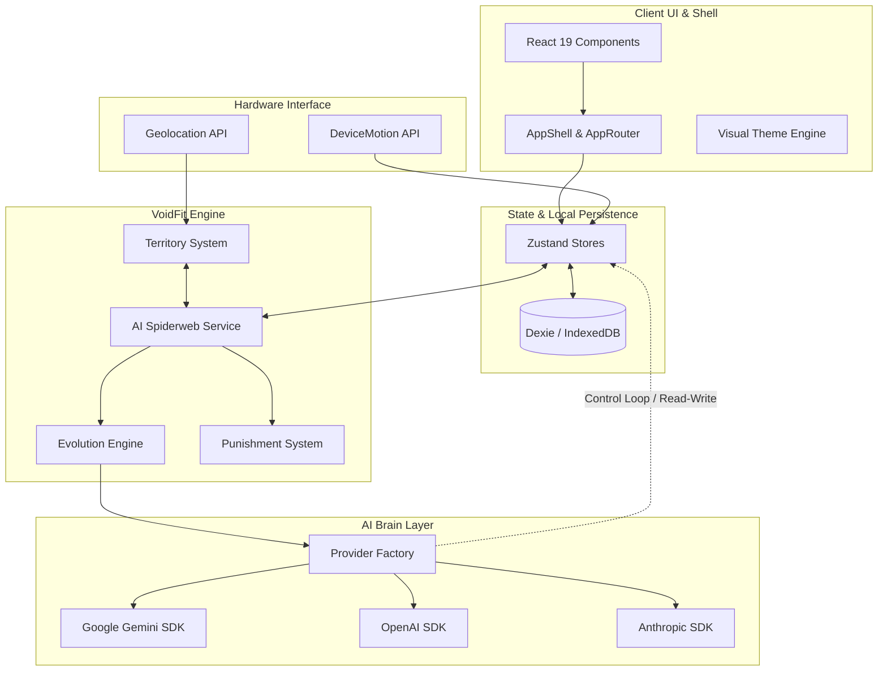

# 🌌 VOIDFIT AI — FITNESS OS
### "Turn your physiological existence into an RPG. Track, evolve, conquer, or face the consequences."

VoidFit AI is a premium, gamified, AI-powered Fitness OS that turns your daily physical training, recovery, and nutrition habits into a immersive Role-Playing Game (RPG). Earn Experience Points (XP), level up your character, allocate skill points on a customizable skill tree, complete dynamically generated daily quests, claim real-world geographical zones, and collaborate or compete with friends in guilds and PvP.

Built using **React 19**, **TypeScript**, and **Vite 6**, the app is engineered to be **offline-first** (powered by **Dexie** and **IndexedDB**) with optional cloud synchronization through **Firebase 11**.

---

## 🎛️ System Architecture

---

## 🎮 Game Systems & RPG Mechanics

### 1. Progression & Ranks
Your fitness status is unified under a single character sheet. 
- **Levels & XP**: Completing workouts, capturing territories, logging recovery, and hitting step goals grants XP. Reaching the XP threshold triggers a visual Level-Up ceremony, granting **+5 Stat Points**.
- **Stat Allocation**: Players manually allocate points into six core attributes:
  - **Strength**: Modifies combat power and strength-related task efficiency.
  - **Endurance**: Boosts cardiorespiratory thresholds and speed ratings.
  - **Flexibility**: Reduces injury rates and improves posture metrics.
  - **Combat**: Influences multiplayer PvP calculations.
  - **Nutrition**: Enhances metabolic efficiency and calorie targets.
  - **Recovery**: Increases recovery speed scores and reduces fatigue penalties.
- **Ranks**: Auto-progress through adventurer-tier ranks: **E → D → C → B → A → S → SS → SSS** based on level achievements.

### 2. The Interactive Skill Tree
Features a custom node-based progression system. Accumulate XP in dedicated Realms (**Strength**, **Endurance**, **Mindfulness**, **Nutrition**) to unlock special active/passive nodes. 
- **Hidden Skills**: Reaching specific levels in primary skills automatically reveals secret skill paths (e.g., *Zen Breath*, *Iron Core*, *Sprint Surge*).

### 3. Active Buffs & Status Conditions
The AI can bestow items or positive status updates based on your behaviors, or you can purchase them.
- **XP Boost**: Multiplies incoming XP from all activities (e.g. `Double XP` x2.0).
- **Shield**: Prevents XP loss or level demotion if a daily commitment is missed.
- **Recovery Buff**: Multiplies sleep quality scoring models.

### 4. The Punishment System (Discipline Protocol)
Consistency is enforced programmatically by [PunishmentSystem.ts](file:///c:/Users/black/Downloads/Levelup-app-production-ready/Levelup-app-clean/src/services/PunishmentSystem.ts):
- **60-Second Grace Period**: On app startup/reload, active checks are deferred for 60 seconds to avoid accidental trigger loops due to db delays.
- **Daily Guard**: The system logs a `lastPenaltyDate` to guarantee a player is never penalized more than once per calendar day.
- **Deduction Triggers**:
  - `MISSION_FAILURE`: Deducts **500 XP** if a daily generated mission is failed.
  - `TOTAL_DISCIPLINE_FAILURE`: Deducts **1000 XP** if no habits are completed yesterday (active only after the 2nd day of install to prevent fresh-install penalties).
- **AI Reaction Integration**: On penalty trigger, the system invokes `reportEventToAi` to alert the AI Coach, writing a custom direct prompt warning to the user's logs.

---

## 🧠 The AI Orchestrator (Brain OS)

VoidFit AI utilizes a high-level cognitive loop that abstracts AI calls into a unified, secure, and reactive system.

### 1. Multi-Provider Abstraction
Located in [src/services/ai](file:///c:/Users/black/Downloads/Levelup-app-production-ready/Levelup-app-clean/src/services/ai), the factory instantiates the designated wrapper:
- `GeminiProvider`: Direct native integration supporting multimodal inputs (e.g., photo analysis, daily reports).
- `OpenAiProvider` & `AnthropicProvider`: Secondary engines running general chats and key validations.

### 2. The AI Adaptation Service (Control Loop)
Defined in [aiAdaptationService.ts](file:///c:/Users/black/Downloads/Levelup-app-production-ready/Levelup-app-clean/src/services/aiAdaptationService.ts), the AI acts as a **system controller** with direct read/write privileges over the user model. Every 6 hours, the AI:
- Reviews biometric stats, 7-day logs, sleep schedules, active injuries, and schedules.
- Computes behavioral trends (e.g., average completion rates, strongest/weakest realms).
- **Writes back** changes to the local state: toggling mode flags (`isInjuryMode`, `isLazyMode`), adding/removing habits, updating weight targets, adjusting step or water goals, and granting achievements/badges.

### 3. The AI Spiderweb Service (Unified Event Bus)
The [AiSpiderwebService.ts](file:///c:/Users/black/Downloads/Levelup-app-production-ready/Levelup-app-clean/src/services/AiSpiderwebService.ts) acts as a reactive nervous system.
- **Events Captured**: `MEAL_SCAN`, `STEP_UPDATE`, `WORKOUT_COMPLETE`, `RECOVERY_LOG`, `HABIT_DONE`, `MOOD_LOG`, `TERRITORY_CAPTURE`, `WATER_LOG`, `SUPPLEMENT_TAKEN`, `POSTURE_LOG`, `BODY_METRICS_UPDATE`.
- **Integrity Validation**: All metrics are checked for boundaries (e.g., posture scale 1-10, sleep hours 0-24, water amount 0-5000ml) to reject anomalies.
- **Cross-Effects Engine**: When an event fires, the Spiderweb automatically evaluates side-effects (e.g. `HABIT_DONE` inserts database records, updates streak metrics, and triggers a `Strength` realm reward).
- **Integrity Hashing**: Generates an obfuscated state integrity hash of the user snapshot:
  $$\text{hash} = \text{date} + \text{calories} + \text{protein} + \text{steps} + \text{water} + \text{recovery} + \text{habits}$$
  This detects unauthorized data tampering and keeps track of a 500-entry audit log.
- **Context Builder**: Compacts daily statistics and current flags (e.g., `⚠Sleep deprived`, `⚠High stress`, `⚠Low motivation`) into a standardized string format for direct consumption by LLM prompts:
  `[2026-06-18|CAL:1500/2000|PRO:120/150g|STP:8000/10000|WTR:2000/3000ml|MISS:1/0|XP:350|STR:5d|RLM:S5/E8/F2|HBT:4|⚠Sleep deprived]`

---

## 🛰️ Sensors & Web Hardware Integration

### 1. Territory Mapping & Geolocation
Implemented in [TerritorySystem.ts](file:///c:/Users/black/Downloads/Levelup-app-production-ready/Levelup-app-clean/src/services/TerritorySystem.ts), the mapping engine lets users claim real-world coordinates.
- **GPS Watch**: Listens to GPS coordinates via `navigator.geolocation.watchPosition` with high accuracy and low latency.
- **Anti-Cheat Validation**: Checks speed thresholds based on activity mode:
  - **Walk**: $\le 5\text{ m/s}$
  - **Run**: $\le 10\text{ m/s}$
  - **Bike**: $\le 20\text{ m/s}$
  If a speed limit is crossed (verified with GPS accuracy $< 50\text{m}$), the point is marked as a violation. Accumulating $>3$ violations marks the user as a cheater and stops the track.
- **Area Capture Algorithm**: Uses a **Polygon Area Calculation** based on the Haversine formula and coordinates:
  $$\text{Area} = \frac{1}{2} \left| \sum_{i=0}^{n-1} (x_i y_{i+1} - x_{i+1} y_i) \right| \times \text{correction factor}$$
  If a user makes a loop returning within 20m of their starting coordinate after at least 15 tracked nodes, the polygon is converted into a captured territory.
- **XP Scaling**: Grants $1\text{ XP}$ per $10\text{ m}^2$ (capped between $10\text{ XP}$ and $500\text{ XP}$).

### 2. DeviceMotion Step Counting
- Pulls live sensor readings from the hardware accelerometer.
- Dynamic step length is derived from height:
  $$\text{Stride Length (m)} = \text{Clamp}(0.5\text{m}, 1.0\text{m}, \text{Height (m)} \times 0.413)$$
  This scales the step calculations to fit the user's biometrics.

---

## 🏛️ UI Shell & Layout Elements

- **View Router**: Managed globally using Zustand (`useUiStore().view`). Views are swapped dynamically in [AppRouter.tsx](file:///c:/Users/black/Downloads/Levelup-app-production-ready/Levelup-app-clean/src/app/shell/AppRouter.tsx).
- **Diagnostics & Muscle Anatomy Heatmap**: [BodyAnatomy.tsx](file:///c:/Users/black/Downloads/Levelup-app-production-ready/Levelup-app-clean/components/BodyAnatomy.tsx) renders an interactive anatomical map mapping fatigue levels (rested, sore, fatigued) onto visual muscle groups.
- **Theme Engine**: Swaps styling classes on the root HTML element dynamically supporting `Dragon` (red/gold accents), `Cyber` (neon cyan/magenta), and `Mystic` (deep void purples).

---

## 🗄️ Dexie Local Database Schema

The database is built on **IndexedDB** using **Dexie 4** for lightning-fast queries and reactive binding:

| Table | Primary Key | Description |
| :--- | :--- | :--- |
| `dailyMissions` | `date` (YYYY-MM-DD) | Stores the active workout instructions and nutrition targets |
| `habitLogs` | `id` | Logs habit verification checks |
| `waterLogs` | `id` | Logs individual hydration amounts |
| `nutritionLogs` | `id` | Holds meals, macro profiles, and calorie targets |
| `recoveryLogs` | `id` | Holds sleep length, quality, soreness, and fatigue ratings |
| `moodLogs` | `id` | Tracks stress, motivation, and burnout indexes |
| `supplementLogs`| `id` | Tracks supplements checked off |
| `activityLogs` | `date` | Standard fitness activities performed, XP awarded |
| `trails` | `id` | Active or saved GPS paths |
| `territories` | `id` | Polygon collections of captured territories |
| `systemMessages`| `id` | Internal event system audit logs |
| `chatLogs` | `id` | Historical chat history between user and AI Coach |

---

## 📄 Development Conventions

If you are expanding the system:

1. **Add AI Calls**: Add your endpoint inside [geminiService.ts](file:///c:/Users/black/Downloads/Levelup-app-production-ready/Levelup-app-clean/services/geminiService.ts) and register the path inside `docs/ai-surface-map.json`.
2. **Modify Database**: Update the schema declarations in [database.ts](file:///c:/Users/black/Downloads/Levelup-app-production-ready/Levelup-app-clean/src/db/database.ts) and increment the database version counter.
3. **Change Themes**: Declare custom theme palettes in [themes.ts](file:///c:/Users/black/Downloads/Levelup-app-production-ready/Levelup-app-clean/src/app/theme/themes.ts).

---

## 📄 License
This project is licensed under the **MIT License**.
